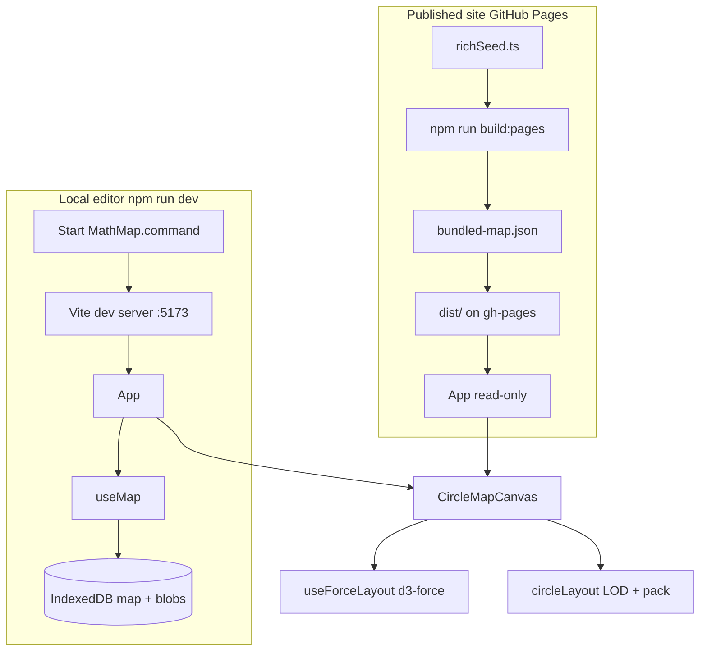

# MathMap — Developer handoff

> **New to this folder?** Read **[START-HERE.md](./START-HERE.md)** first for the reading order and first steps.

This document is for a human developer taking over the project.

---

## 1. What this project is

MathMap is a **static, client-only** web app for building and viewing an interactive **circle map of mathematical concepts**:

- **Fields** appear as large colored discs.
- **Subfields** (from MSC2020 codes) appear at medium zoom.
- **Concepts** appear as sized dots at high zoom.
- Users connect concepts with **manual edges**, write **definitions / history / notes**, attach **images and PDFs**, and search by title, MSC code, or tag.

There is **no backend**. All editor data lives in the browser (IndexedDB). Sharing is done via portable **`.mathmap` files** (ZIP) or a **published static website**.

### Two products, one codebase

| Mode | How you run it | Data source | Can edit? |
|------|----------------|-------------|-----------|
| **Local editor** | `Start MathMap.command` / `npm run dev` | IndexedDB; starts **blank** | Yes |
| **Published site** | GitHub Pages at `sylviehan.github.io/MathMap` | `public/bundled-map.json` | No (read-only) |

This split is intentional:

- **Cloners** get an empty canvas and build their own map.
- **Visitors** see Sylvie’s curated map on the public URL without installing anything.

The mode is chosen at **build time** (`VITE_PUBLISHED_SITE`) and **runtime** (`import.meta.env.DEV`, URL query params). See [§4 Site modes](#4-site-modes-local-editor-vs-published-site).

---

## 2. Quick start (developer)

**Requirements:** Node.js **20+**, npm.

```bash
git clone https://github.com/SylvieHan/MathMap.git
cd MathMap
npm install
npm run dev -- --open
```

Editor opens at **http://localhost:5173** (Vite default). Launchers use `--open --port 5173 --strictPort` and kill stale processes on 5173 (macOS/Linux).

**Useful scripts** (`package.json`):

| Script | Purpose |
|--------|---------|
| `npm run dev` | Local **editor** (full UI, IndexedDB) |
| `npm run dev:site` | Local preview of **published** read-only site |
| `npm run build` | Typecheck + production build (editor default) |
| `npm run build:site` | Build with `VITE_PUBLISHED_SITE=true` |
| `npm run build:pages` | GitHub Pages build (`/MathMap/` base path) |
| `npm run deploy` | `build:pages` + push `dist/` to `gh-pages` branch |
| `npm run lint` | ESLint |

**Prebuild hook:** every `build` runs `scripts/export-bundled-map.ts`, which writes `public/bundled-map.json` from `src/data/richSeed.ts`.

---

## 3. Repository layout

```
MathMap/
├── Start MathMap.command   # macOS double-click → start-mathmap.sh
├── start-mathmap.sh        # macOS/Linux launcher
├── start-mathmap.bat       # Windows launcher
├── GETTING-STARTED.md      # End-user guide
├── PUBLISH.md              # How to deploy the read-only site
├── DEVELOPER.md              # This file
├── README.md                 # Project overview
├── package.json
├── vite.config.ts            # base path for GitHub Pages vs local
├── scripts/
│   ├── export-bundled-map.ts # richSeed → public/bundled-map.json
│   └── deploy-site.mjs       # npm run deploy (gh-pages)
├── public/
│   ├── bundled-map.json      # Generated; shipped with published build
│   ├── favicon.svg
│   └── icons.svg
└── src/
    ├── main.tsx              # React entry
    ├── App.tsx               # Shell: toolbar, canvas, side panel
    ├── index.css             # Global + toolbar grid layout
    ├── types/
    │   ├── index.ts          # MathMap, MapNode, MapEdge, ContentBlock
    │   └── selection.ts      # MapSelection, DrillState (zoom drill-down)
    ├── data/
    │   ├── richSeed.ts       # Sylvie’s published map content (~65 concepts)
    │   ├── maps.ts           # createEmptyMap, createSeedMap, factories
    │   └── msc2020.ts        # MSC2020 label lookup
    ├── db/
    │   └── index.ts          # IndexedDB (map + blobs)
    ├── hooks/
    │   ├── useMap.ts         # Load/save, import/export, CRUD
    │   ├── useForceLayout.ts # d3-force tick loop → CircleItem[]
    │   ├── useTheme.ts       # light/dark in localStorage
    │   └── usePreventBrowserZoom.ts
    ├── context/
    │   └── LatexConfigContext.tsx
    ├── components/
    │   ├── CircleMapCanvas.tsx  # Main SVG map (zoom, pan, drag, LOD)
    │   ├── Toolbar.tsx
    │   ├── SidePanel.tsx
    │   ├── SearchBar.tsx
    │   ├── FieldLegend.tsx
    │   ├── ContentBlocks.tsx
    │   ├── LatexSettingsModal.tsx
    │   └── …
    └── utils/
        ├── siteMode.ts       # read-only / embed / bundled URL
        ├── circleLayout.ts   # LOD, packing, CircleItem geometry
        ├── forceLayout.ts    # d3-force graph for field nodes
        ├── exportImport.ts   # .mathmap ZIP format
        ├── merge.ts          # merge import with ID suffixing
        ├── colors.ts, latex.ts, wheelZoom.ts, …
```

**Not in git / excluded from handoff zip:** `node_modules/`, `dist/`, `.env`, `*.mathmap`, `.cursor/`.

---

## 4. Site modes (local editor vs published site)

All logic lives in `src/utils/siteMode.ts`.

```typescript
isPublishedSite()   // VITE_PUBLISHED_SITE === 'true' at build time
isReadOnlyMode()    // false in DEV; true on published build or ?view=1
isEmbedMode()       // ?embed=1 — trims chrome for Google Sites iframe
getBundledMapUrl()  // where read-only mode loads map JSON from
```

**Read-only rules:**

- `import.meta.env.DEV === true` → **always editor**, even if env flags are set. This is why `npm run dev` always shows edit buttons.
- Production + `VITE_PUBLISHED_SITE=true` → loads `BASE_URL + 'bundled-map.json'`, hides edit controls.
- `?view=1` or `?readonly=1` on a non-published build → read-only + bundled map (for ad-hoc preview).
- `?embed=1` → compact layout class on `<div class="app">`.

**Data loading** (`src/hooks/useMap.ts`):

1. If read-only and bundled URL exists → `fetch(bundled-map.json)`.
2. Else → IndexedDB `loadMap()`.
3. If no stored map → `createEmptyMap()` (blank editor).
4. One-time migration (`localEditorProtocol`): old auto-demo seeds titled `"My MathMap"` are replaced with blank map.

**Important:** `richSeed.ts` is **only** for the published website (via `export-bundled-map.ts`). The local editor does **not** auto-load it anymore.

---

## 5. Data model

Defined in `src/types/index.ts`.

### MathMap

```typescript
{
  meta: { title, author, createdAt, seedVersion?, latexPackages?, localEditorProtocol? },
  nodes: MapNode[],
  edges: MapEdge[]   // manual edges only; tag similarity is visual/layout only
}
```

### MapNode

- `type`: `'concept' | 'field-folder'`
- `parentId`: nests concepts under field folders
- `mscCodes`: MSC2020 codes (drive color + subfield grouping)
- `customTags`: user tags
- `position`, `pinned`: layout; pinned nodes skip re-layout reset
- `definition`, `historyAndReferences`: side panel sections
- `content`: array of `ContentBlock` (text markdown, image, pdf, link)
- `collapsed`: folder expand/collapse

### Storage (IndexedDB)

Database name: `mathmap-db` (`src/db/index.ts`).

| Store | Key | Value |
|-------|-----|-------|
| `map` | `'current'` | Full `MathMap` JSON |
| `blobs` | blob UUID | `Blob` for images/PDFs |

Images/PDFs in nodes reference blobs by `blobId`. Export gathers referenced blobs into the ZIP.

### `.mathmap` file format

ZIP archive (`src/utils/exportImport.ts`):

```
my-map.mathmap
├── manifest.json    # version: 1, meta, nodes (serialized content), edges
└── assets/
    └── {blobId}     # binary files
```

Import supports **replace** or **merge** (`src/utils/merge.ts`). Merge renames conflicting node IDs with `-2`, `-3`, … suffixes.

---

## 6. UI architecture

```
App.tsx
├── Toolbar          title | search (center) | actions
├── CircleMapCanvas  SVG map, zoom/pan, selection
├── SidePanel        edit selected node/edge (hidden in read-only for edits)
└── LatexSettingsModal
```

**State ownership:**

- `useMap()` — single source of truth for map data + persistence.
- `App` — selection, drill-down, search highlight, settings modal.
- `CircleMapCanvas` — camera transform, gestures, delegates moves to `useMap`.

**Toolbar layout** (`src/index.css`): CSS grid, one row — `toolbar-left | toolbar-center (search) | toolbar-right`. Do not re-add `flex-wrap` on `.toolbar` or search drops to a second line.

---

## 7. Map rendering pipeline

This is the most complex part of the codebase.

### Level of detail (LOD)

`zoomToDetailLevel(scale)` in `circleLayout.ts`:

| Zoom scale `k` | Level | What you see |
|----------------|-------|--------------|
| `k < 0.55` | `fields` | Field discs only |
| `0.55 ≤ k < 1.05` | `subfields` | Subfield clusters inside fields |
| `k ≥ 1.05` | `concepts` | Individual concept dots |

`CircleMapCanvas` computes `CircleItem[]` (x, y, r, kind, colors, labels) from nodes + current drill state.

### Layout

1. **Field-level physics** — `d3-force` simulation in `forceLayout.ts` / `useForceLayout.ts`. Only **field folder** nodes are simulation bodies; concepts/subfields follow via offset sync (`syncChildrenToFields`).
2. **Circle packing** — spiral pack inside field discs (`packInCircle` in `circleLayout.ts`).
3. **Concept radius** — from content weight, edge count, tags (`conceptRadius`).

**Re-layout** (toolbar): unpinned nodes get `position: {0,0}`; simulation re-runs from scratch.

**Pin:** double-click node toggles `pinned`; pinned nodes are fixed during simulation.

**Shift+drag:** adjusts “tension” / manual offset (works in read-only too for exploration feel).

### Interaction (`CircleMapCanvas.tsx`)

- Pan, pinch/wheel zoom (`wheelZoom.ts`, Safari gesture handlers)
- Click to select; click field/subfield to drill camera
- Drag nodes (editor) or pan (background)
- Edge hit-testing for selection (`edgeHitTest.ts`)
- `usePreventBrowserZoom` stops browser page zoom on trackpad pinch over the map

### Search

`SearchBar` filters nodes; `highlightIds` dims non-matches on canvas.

---

## 8. Published map content

**Source of truth for the live website:** `src/data/richSeed.ts`

- ~8 fields, ~65 concepts with definitions, history, notes.
- `SEED_VERSION = 5` (metadata only; editor no longer auto-seeds from this).

**Build pipeline:**

```
richSeed.ts
    ↓  scripts/export-bundled-map.ts  (runs on prebuild)
public/bundled-map.json
    ↓  npm run build:pages
dist/bundled-map.json  →  deployed to gh-pages
```

To update the live site:

1. Edit `richSeed.ts` (or export a `.mathmap` and convert — no script for that yet; manual or extend export script).
2. Run `npm run deploy` (needs `gh-pages` auth / push access).
3. Site URL: `https://sylviehan.github.io/MathMap/`

Optional env when exporting:

```bash
PUBLISH_MAP_TITLE="My Title" PUBLISH_MAP_AUTHOR="Name" npm run build:pages
```

---

## 9. Deployment (current setup)

**GitHub Pages via `gh-pages` branch** — not GitHub Actions (workflow was removed because PAT lacked `workflow` scope).

```bash
npm run deploy
```

This runs `scripts/deploy-site.mjs`:

1. `npm run build:pages` (`VITE_PUBLISHED_SITE=true`, `VITE_BASE_PATH=/MathMap/`)
2. `npx gh-pages -d dist`

Git identity for the deploy commit comes from env vars (`GIT_AUTHOR_NAME`, etc.) or defaults in the script — **does not** modify global git config.

**Vite base path** (`vite.config.ts`):

- Local / custom domain: `base: '/'`
- GitHub Pages project site: `VITE_BASE_PATH=/MathMap/` when `GITHUB_PAGES=true`

**Google Sites embed:** `?embed=1` on the published URL. See [PUBLISH.md](./PUBLISH.md).

---

## 10. Environment variables

| Variable | When | Effect |
|----------|------|--------|
| `VITE_PUBLISHED_SITE=true` | build | Read-only site build |
| `VITE_BASE_PATH=/MathMap/` | build | Asset paths for GitHub Pages subpath |
| `GITHUB_PAGES=true` | build | Fallback base `/MathMap/` if no explicit base |
| `PUBLISH_MAP_TITLE` | prebuild export | Override title in bundled-map.json |
| `PUBLISH_MAP_AUTHOR` | prebuild export | Override author in bundled-map.json |
| `GIT_AUTHOR_*` / `GIT_COMMITTER_*` | deploy script | Commit author on gh-pages push |

Vite exposes only `VITE_*` vars to client code via `import.meta.env`.

---

## 11. Styling & theming

- Global CSS variables in `src/index.css` (`--bg`, `--text`, `--border`, …).
- `useTheme()` toggles `light` / `dark` on `document.documentElement`, persisted in `localStorage`.
- Embed mode: `.app.is-embed` hides some chrome.

---

## 12. LaTeX / math rendering

- KaTeX via `src/utils/latex.ts` and `LatexConfigContext`.
- Default packages in `DEFAULT_LATEX_PACKAGES`; user toggles in **LaTeX settings** modal (stored in `map.meta.latexPackages`).
- Rich text fields use `RichTextField` + `MarkdownPreview` with inline `$…$` and `$$…$$`.

---

## 13. Common tasks for the next developer

### Change the public map

Edit `src/data/richSeed.ts` → `npm run deploy`.

### Add a toolbar button

1. Add handler prop in `Toolbar.tsx`.
2. Wire from `App.tsx` to `useMap()` or local state.
3. Adjust `src/index.css` grid if the row overflows (toolbar scrolls horizontally).

### Add a node field

1. Extend `MapNode` in `types/index.ts`.
2. Update `SidePanel` UI.
3. Update export/import if persisted (manifest is JSON — backward compatible if optional).
4. Update `merge.ts` if IDs/titles need conflict rules.

### Change zoom LOD thresholds

Edit `zoomToDetailLevel` in `circleLayout.ts` and test in `CircleMapCanvas`.

### Add backend / sync (not implemented)

Would need new API, auth, and conflict resolution. Current design deliberately avoids this.

---

## 14. Known limitations & future ideas

| Area | Notes |
|------|-------|
| **Collaboration** | Export/merge `.mathmap` only; no real-time sync |
| **Layout** | Large maps may need performance tuning; simulation runs on main thread |
| **README drift** | Some README lines still mention GitHub Actions deploy — actual path is `npm run deploy` |
| **Cytoscape** | Listed in `package.json` but circle map replaced graph canvas; dependency may be removable |
| **Markdown** | Lightweight custom parser, not full CommonMark |
| **Mobile** | Usable but optimized for desktop trackpad/mouse |

---

## 15. Testing & quality

No automated test suite yet. Manual checklist:

- [ ] `npm run dev` — blank map, full toolbar on **one row**, search centered
- [ ] Add concept, folder, edge; export; import replace + merge
- [ ] Pin, re-layout, shift+drag tension
- [ ] LaTeX settings persist after reload
- [ ] `npm run dev:site` — read-only, rich map loads
- [ ] Pinch zoom on map (not browser zoom)
- [ ] `npm run build` && `npm run lint` pass

---

## 16. Handoff checklist

- [ ] Clone repo, `npm install`, launcher works
- [ ] Read this file + skim `useMap.ts`, `CircleMapCanvas.tsx`, `siteMode.ts`
- [ ] Confirm GitHub Pages live at published URL
- [ ] Confirm `gh-pages` branch exists; deploy with `npm run deploy`
- [ ] Do **not** commit `.mathmap` exports or `.env` (see `.gitignore`)
- [ ] Owner: Sylvie Han — [github.com/SylvieHan/MathMap](https://github.com/SylvieHan/MathMap)

---

## 17. Architecture diagram



---

*Last updated: handoff pack for MathMap v1.0.0 — June 2026.*
